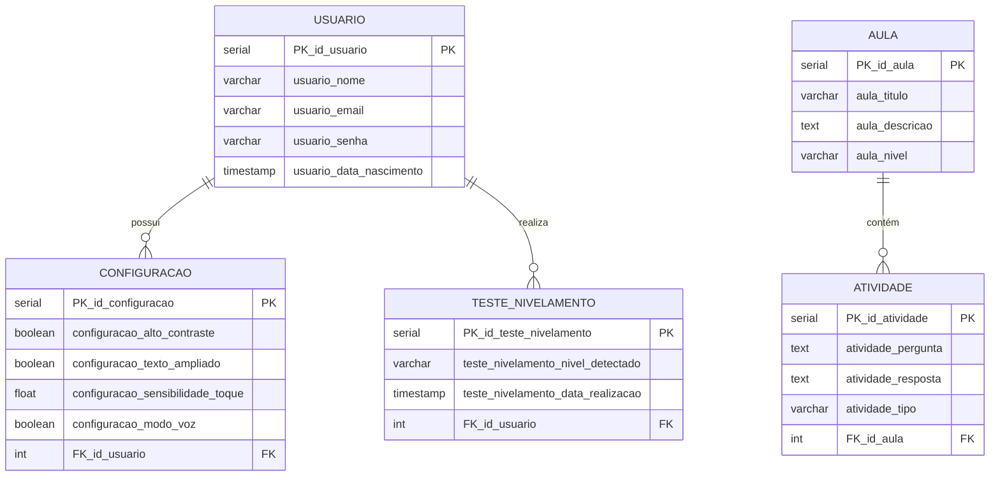
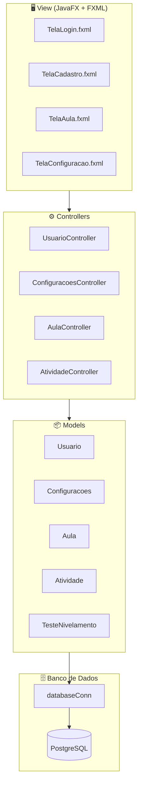

# 📚 Cognito

## 👥 Integrantes do Grupo

| Nome | Função |
|------|--------|
| Carlos Gabriel Monteiro de Sousa | Tech Lead |
| Alvaro Lúcio Mousinho Coelho | DEV back-end |
| Leticia de Oliveira Soares Leandro | Analista de Requisitos | 
| João Eduardo de Soares Pessoa | DEV front-end |
| Pedro Henrique Silva Rufino | DBA |
| Artur França de Paula Araújo | DBA |

---

## 📖 Apresentação do Sistema

O **Cognito** é uma aplicação desktop desenvolvida em **Java com JavaFX**, voltada para Auxiliar no aprendizado de idosos nos dispositivos moveis.

O sistema permite que usuários:

- Assita videos aulas explicativas ensinando desde o basico ao avançado.
- Acesse aula e exercicios baseados no seu nivel de conhecimento.
- Tenha uma experiencia personalizada de acordo com seu nivel de familiaridade com o mundo digital.
- Personalizem sua experiência através de configurações de acessibilidade.

---

## 🗄️ Diagrama de Entidade Relacionamento (DER)



---

## 🧩 Diagrama de Componentes



---

## ✅ Checklist de Inspeção de Qualidade

### Código
- [ ] Nomenclatura de classes, métodos e variáveis está padronizada
- [ ] Todos os métodos possuem responsabilidade única
- [ ] Não há código duplicado
- [ ] Tratamento de exceções implementado nas operações de banco
- [ ] Conexões com o banco são fechadas corretamente (try-with-resources)
- [ ] Nenhuma senha ou credencial exposta no código-fonte

### Banco de Dados
- [ ] Todas as tabelas possuem chave primária
- [ ] Chaves estrangeiras estão corretamente referenciadas
- [ ] Constraints de NOT NULL aplicadas onde necessário
- [ ] Script SQL testado e funcional

### Interface (JavaFX)
- [ ] Todos os campos obrigatórios possuem validação
- [ ] Mensagens de erro são claras para o usuário
- [ ] Navegação entre telas funciona corretamente
- [ ] Tela de configurações reflete os valores salvos no banco

### Geral
- [ ] Sistema roda sem erros no ambiente de desenvolvimento
- [ ] README está completo e atualizado
- [ ] Todos os integrantes conseguem rodar o projeto localmente

---

## 🚀 Como Rodar o Sistema

### Pré-requisitos

- Java JDK 17 ou superior
- Maven 3.8+
- PostgreSQL 9.14
- IntelliJ IDEA (recomendado)

### Passo a Passo

**1. Clone o repositório**
```bash
gh repo clone alvarolucio2007/Cognito
cd Cognito
```

**2. Configure o banco de dados**

- Crie um banco chamado `mydb` no PostgreSQL
- Execute o script SQL disponível na seção abaixo
- Verifique as credenciais em `src/main/java/database/conn/databaseConn.java`:
- (Opcional) Comando docker para a inicialização da DB:
   ``` bash
  docker run -d --name cognitodb_container -p 5432:5432 -e POSTGRES_DB=cognitodb -e POSTGRES_USER=cognito_user -e POSTGRES_PASSWORD=Cognito123 postgres:18-alpine
  ```

```java
private static final String url      = "jdbc:postgresql://localhost:5432/cognitodb";
private static final String user     = "Cognito";
private static final String password = "Veritas";
```

> Altere as credenciais se necessário para o seu ambiente.

**3. Instale as dependências**
```bash
mvn clean install
```

**4. Execute o projeto**
```bash
mvn javafx:run
```

---

## 🗃️ Script SQL

```sql
CREATE TABLE usuario (
    PK_id_usuario           SERIAL PRIMARY KEY,
    usuario_nome            VARCHAR(100) NOT NULL,
    usuario_email           VARCHAR(100) NOT NULL UNIQUE,
    usuario_senha           VARCHAR(255) NOT NULL,
    usuario_data_nascimento TIMESTAMP
);

CREATE TABLE configuracao (
    PK_id_configuracao               SERIAL PRIMARY KEY,
    configuracao_alto_contraste      BOOLEAN DEFAULT FALSE,
    configuracao_texto_ampliado      BOOLEAN DEFAULT FALSE,
    configuracao_sensibilidade_toque FLOAT   DEFAULT 1.0,
    configuracao_modo_voz            BOOLEAN DEFAULT FALSE,
    FK_id_usuario                    INT REFERENCES usuario(PK_id_usuario)
);

CREATE TABLE teste_nivelamento (
    PK_id_teste_nivelamento           SERIAL PRIMARY KEY,
    teste_nivelamento_nivel_detectado VARCHAR(50),
    teste_nivelamento_data_realizacao TIMESTAMP,
    FK_id_usuario                     INT REFERENCES usuario(PK_id_usuario)
);

CREATE TABLE aula (
    PK_id_aula     SERIAL PRIMARY KEY,
    aula_titulo    VARCHAR(150) NOT NULL,
    aula_descricao TEXT,
    aula_nivel     VARCHAR(50)
);

CREATE TABLE atividade (
    PK_id_atividade   SERIAL PRIMARY KEY,
    atividade_pergunta TEXT NOT NULL,
    atividade_resposta TEXT NOT NULL,
    atividade_tipo     VARCHAR(50),
    FK_id_aula         INT REFERENCES aula(PK_id_aula)
);
```

---

## 🛠️ Tecnologias Utilizadas

| Tecnologia | Versão |
|------------|--------|
| Java | 17+ |
| JavaFX | 21 |
| PostgreSQL | 9.14 |
| Maven | 3.8+ |
| JDBC Driver PostgreSQL | 42.7.4 |

---
> *"Cognito, ergo sum."*
> — **René Descartes (adaptado)**

UNIFSA - Engenharia de Software 3° Periodo
